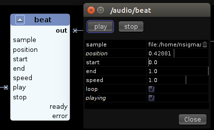
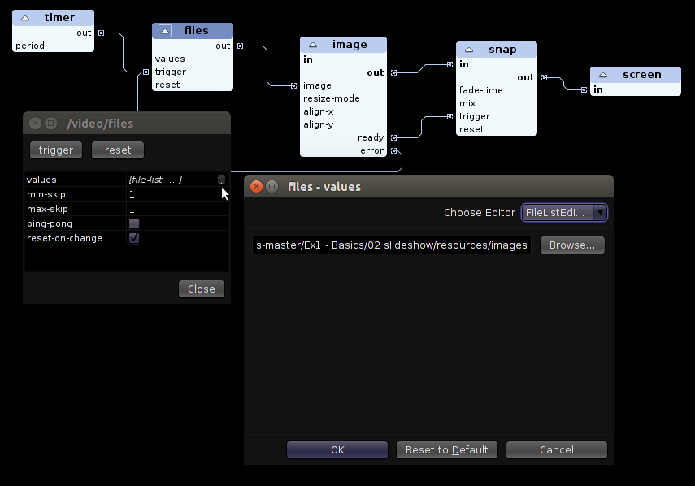

# Component editors

The above image shows the editor dialog opened by double-clicking on a component, in this case an `audio:sampleplayer`.

At the top of the editor are buttons for action controls defined by the component, here for playing and stopping the player. These actions are also accessible from the pop-up menu of the component itself.

Below the actions is the property table. This is the same table that will show in the `Properties` tab when you select the component. You can change individual values by clicking on the value cell with the mouse and entering the new value. You can also use the arrow keys on the keyboard to move between different values – click `SPACE` to highlight and edit a value. Type the new value and press `ENTER` to change – if you change your mind you can also use `ESCAPE` to revert. The pop-up menu on each value also gives the option to revert to the default value of that property.

Numeric values that have a defined range (eg. `speed`) have a vertical line that represents the current value. You can also change these values by clicking and dragging the mouse within the value cell, just like you would use a slider. A short click still works to highlight the cell to edit by text.

Properties marked in italics (eg. `playing`) are transient. This means that although you can control these properties, the value is not saved when you save the file. Transient is used for cases where it is unlikely you want to save the current value, maybe because it is continuously changing. In this case, should you want the sample-player to start playing immediately, you should create a `core:start-trigger` component and link it to the `play` port.

## Extended editors

Some properties have the ability to open an extended editor – this is represented by the ellipsis button at the right of the value cell. Clicking on this button will open the extended editor window. Other properties may open the extended editor whenever you try and edit them.

Depending on the type of the property, there may be more than one extended editor available. A select box will appear at the top right of the extended editor window to allow you to choose which extended editor to use. Alternative extended editors usually reflect functions available within the underlying scripting language. In the example above, the File List Editor is being used to fill the `values` array of a `core:array:iterator` component with the list of files in the given folder. This can be seen in the slideshow example project.

