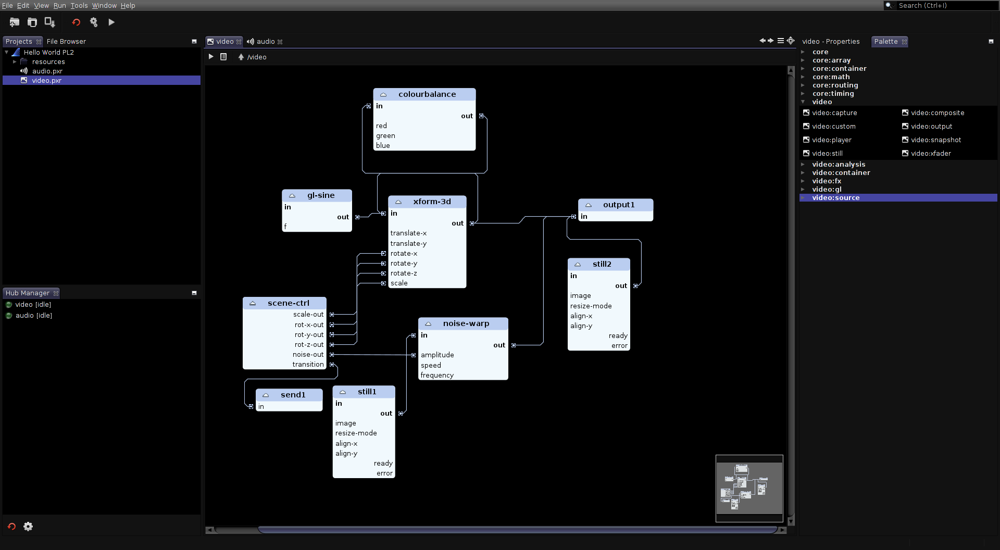
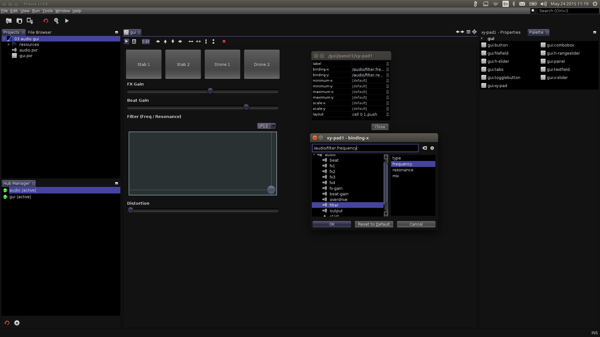

# Editors

Double-clicking on a `.pxr` file will open it in an editor. The type of editor it opens in will depend on the root type (video, audio, gui, etc.). Remember that the project the file belongs to must have
been built so that the root shows up in the `Hub Manager` before the file can be edited, otherwise the editor will contain a message asking you to build the project.

At the top-right of the editor region are four icons. Three of these allow you to switch between open editors. The maximise icon  allows you to enlarge the editor area, minimising all the other windows to the sides and providing more workspace.

All editors have their own toolbar, which contains at least two buttons. The play button  toggles whether the root is playing / active. The root properties button  opens a window allowing you to set properties of the root component (such as video resolution and frame-rate). _Not all root properties can be set while the root is playing_.

You can save a `.pxr` file at any time when the editor is active. You will also be prompted to save whenever the hub is restarting or when a root is removed from the hub. Due to its distributed architecture, _Praxis LIVE_ does not attempt to track all changes, so takes the conservative approach and always prompts you to save.

## Graph editor

The default editor is the graph editor, used for audio, video and tinkerforge files. Components and port connections are represented in a graphical form that should be familiar to anyone who has used other patcher-style environments like AudioMulch, Isadora, Max, etc.

To **add components**, drag the component type you want from the `Palette` window onto the editor. The palette automatically filters valid components depending on the root type. You will be asked to name the component (a unique name will be suggested) – _names cannot be changed once the component is created_.

To **link ports**, click and drag with the mouse between the two ports. You cannot connect ports of incompatible types, and output ports can only be connected to input ports. Audio and video ports are highlighted in bold.

Components and port connections can be removed by selecting them and pressing `Delete` or selecting delete from the pop-up menu.

Selected components may be moved around by dragging with the mouse, and may also be copy & pasted. Multiple components can be selected by clicking and dragging a selection box around them, or by `CTRL-clicking` on each component.

To **control or edit component properties**, double-click on the component to open the component editor window. This window includes buttons for all component actions and a table of all properties
(more information in the Component Editors section). Component actions are also accessible through the pop-up menu on components. When selected, component properties also show up in
the `Properties` tab – if multiple components are selected you can use this tab to control all of them together.

**Zoom in and out** of the graph using `CTRL-mousewheel`, and **navigate** around using the satellite view in the bottom-right of the editor. This makes it easier to spatially organise components.

While it is usually possible to add and remove components at runtime, be aware that currently inputs (audio) and outputs (video / audio) are only picked up when the root is started, and only one of each of these type of components may be used in any patch. For example, if you add an audio input while audio is playing, you will not hear anything until you stop and restart the audio playback.

## GUI (control panel) editor

When you open a GUI / control panel `.pxr` file it will open in the GUI editor. If the GUI was open (running), the external window will be closed and the panel “hijacked” into the editor. The control
panel is still fully functional when open in the editor.

To make changes to the control panel you need to enable the edit overlay. Toggle the `Edit` button in the editor toolbar (or use `CTRL-e`). Component boundaries will now highlight as you hover over
them and you can select component by clicking on them. Switch off the edit overlay (using the same button / keys) to re-enable use of the control panel.

**Add components** to the control panel by dragging them from the palette (the edit overlay must be enabled). You can insert components by dropping them on top of existing components. Unlike the graph editor, the GUI editor gives all components an automatic name.

**Edit component properties** by double-clicking on them to open the component editor window, or selecting them and using the `Properties` tab. The GUI editor does not currently support multiple select.

Components are organised in a grid / table. You can move selected components around the panel by using the arrow buttons in the editor toolbar or the arrow keys on the keyboard. It is possible for components to span multiple rows or columns of the grid, using the buttons in the toolbar or holding `CTRL` while using the arrow keys.

To **bind a GUI component** to a property of another component, use the `.binding` property - you may enter a control address manually or use the address browser (ellipsis button) to search through existing components. GUI components will attempt to configure themselves from the binding – eg. a slider with no minimum / maximum value overrides will use the minimum / maximum values of the bound control. When bound to a property control, GUI components will automatically sync.

**Remove components** by selecting them and using the `Delete` key or the delete button on the editor toolbar.

## MIDI bindings editor

MIDI `.pxr` files will open in the MIDI bindings editor. This is a simple editor that allows you to connect MIDI controllers to any _Praxis LIVE_ control.

To **add a binding**, use the `Add` button in the editor toolbar.

Bindings are arranged in a table. You can **edit bindings** by double-clicking on them to open the component editor, or selecting them and using the `Properties` tab. Some properties are also editable directly within the bindings table.

Unlike GUI components, MIDI bindings do not set up their minimum and maximum values automatically. By default they send a value from 0 to 1.

To **delete a binding**, select it and press `Delete` or use the delete button in the editor toolbar.

## OSC bindings editor

@TODO
